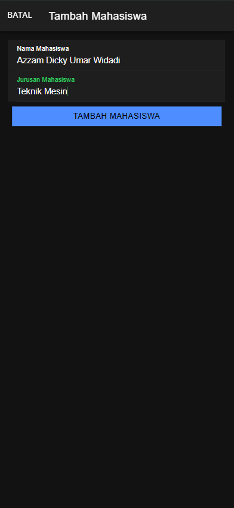
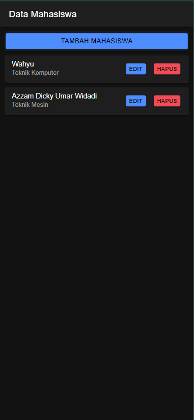
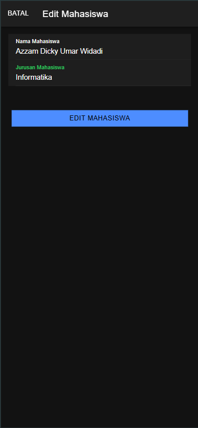
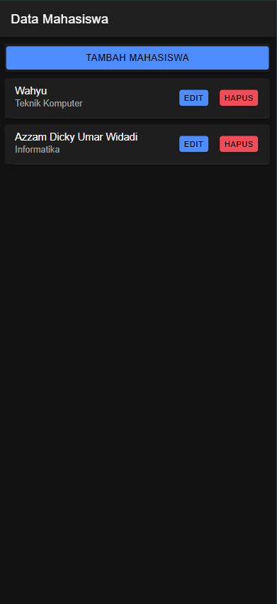
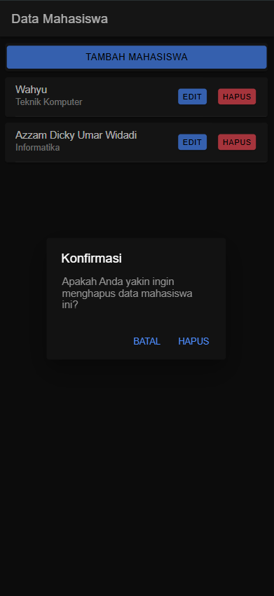
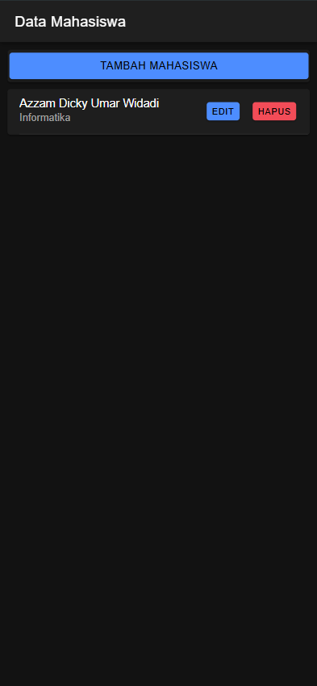

# Tugas Pertemuan 8
IONIC

Nama: Azzam Dicky Umar Widadi 
NIM: H1D022090  
Shift KRS: D
Shift Baru: F

## Screenshot







## Penjelasan Program
### 1. Create (Menambahkan data mahasiswa)
Fitur ini digunakan untuk menambahkan data mahasiswa baru ke dalam database.<br>
alur :<br>
    - Pengguna menekan tombol Tambah Mahasiswa yang akan membuka modal input data.<br>
    - Di dalam modal, pengguna mengisi `nama` dan `jurusan`, kemudian menekan tombol Tambah Mahasiswa.<br>
    - Fungsi `tambahMahasiswa()` di `mahasiswa.page.ts` dipanggil untuk mengirim data ke server melalui API.

##### mahasiswa.page.html
```html
<ion-button (click)="openModalTambah(true)" expand="block">Tambah Mahasiswa</ion-button>
```

##### mahasiswa.page.ts
```typescript
tambahMahasiswa() {
  let data = { nama: this.nama, jurusan: this.jurusan };
  this.api.tambah(data, 'tambah.php').subscribe({
    next: () => { this.getMahasiswa(); },
    error: () => { console.log('gagal tambah mahasiswa'); },
  });
}
```

##### tambah.php
```php
$query = mysqli_query($koneksi, "insert into mahasiswa(nama, jurusan) values('$nama','$jurusan')");
echo json_encode($pesan);
```

### 2. Read (Menampilkan data mahasiswa)
Menampilkan data mahasiswa yang tersimpan di database.<br>
alur :<br>
    - Saat halaman diakses, fungsi `ngOnInit()` memanggil fungsi `getMahasiswa()` untuk mengambil data dari server melalui API.<br>
    - Data yang diterima akan disimpan dalam variabel `dataMahasiswa` dan ditampilkan dalam bentuk card.

##### mahasiswa.page.ts
```typescript
getMahasiswa() {
  this.api.tampil('tampil.php').subscribe({
    next: (res: any) => { this.dataMahasiswa = res; },
    error: (err: any) => { console.log(err); },
  });
}
```

##### tampil.php
```php
$query = mysqli_query($koneksi, "select * from mahasiswa");
while ($row = mysqli_fetch_object($query)) {
    $data[] = $row;
}
echo json_encode($data);
```

### 3. Update (edit data mahasiswa)
Mengubah data mahasiswa yang sudah ada.<br>
alur :<br>
    - Pengguna menekan tombol Edit pada salah satu data mahasiswa.<br>
    - Fungsi `openModalEdit()` akan membuka modal edit dengan data mahasiswa yang diambil menggunakan fungsi `ambilMahasiswa()`.<br>
    - Setelah melakukan perubahan, pengguna menekan tombol Edit Mahasiswa yang akan memanggil fungsi `editMahasiswa()` untuk mengirim data perubahan ke server.

##### mahasiswa.page.ts
```typescript
editMahasiswa() {
  let data = { id: this.id, nama: this.nama, jurusan: this.jurusan };
  this.api.edit(data, 'edit.php').subscribe({
    next: () => { this.getMahasiswa(); },
    error: () => { console.log('gagal edit Mahasiswa'); },
  });
}
```

##### edit.php
```php
$query = mysqli_query($koneksi, "update mahasiswa set nama='$nama', jurusan='$jurusan' where id='$id'");
echo json_encode($pesan);
```

### 4. Delete (Hapus data mahasiswa)
Menghapus data mahasiswa dari database.<br>
alur :<br>
    - Pengguna menekan tombol Hapus pada salah satu data mahasiswa.<br>
    - Fungsi `confirmHapusMahasiswa()` menampilkan konfirmasi sebelum menghapus data.<br>
    - Jika pengguna mengonfirmasi, maka fungsi `hapusMahasiswa()` akan dipanggil untuk menghapus data dari server.

##### mahasiswa.page.ts
```typescript
hapusMahasiswa(id: any) {
  this.api.hapus(id, 'hapus.php?id=').subscribe({
    next: () => { this.getMahasiswa(); },
    error: (error: any) => { console.log('gagal hapus data', error); },
  });
}
```

##### hapus.php
```php
$query = mysqli_query($koneksi, "delete from mahasiswa where id='$id'");
echo json_encode($pesan);
```